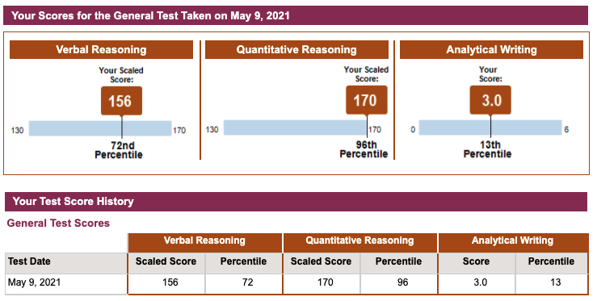

> A brief research on UCLA CS Graduate Program

I am applying for graduate program obviously because I am about to graduate. Here is some of the thougths and key points I collect from the [UCLA CS Program](https://grad.ucla.edu/programs/school-of-engineering-and-applied-science/computer-science/)
[Super Useful FAQ](https://www.cs.ucla.edu/graduate-admission-frequently-asked-questions)
## Basic Info

* Computer Science Graduate Program at UCLA
* 404 Westwood Plaza
* Engineering IV, Room 291
* Box 951596
* Los Angeles, CA 90095-**1596**

## Basic Requirements

### Tofel

If your first language is not English, or if you did not receive your bachelor’s degree in an Anglophone country, you must certify proficiency in English when you apply to UCLA. This applies to U.S. citizens and Permanent Residents as well as international applicants.

#### Exemption Policy

Do you hold a bachelor’s or higher degree from a university located in the United States or in another country in which English is both the primary spoken language of daily life (e.g., Australia, Barbados, Canada, Ireland, Jamaica, New Zealand, United Kingdom) and the medium of instruction?

**OR** Have you completed at least two years of full-time study at such institutions?

If you meet either of these criteria, you are exempted from both the TOEFL/IELTS requirement and the English as a Second Language Placement Examination (ESLPE).  Please be sure to include such information and transcripts in your application.

#### Minimum TOFEL Scores

Special COVID-19 Pandemic Notice: TOEFL iBT **Special Home Edition** scores will be accepted for the 2022-23 application cycle. Please see below for minimum requirements.

For the internet-based TOEFL (TOEFL iBT), the following are the expected scores for each section:

* Writing:  25
* Speaking:  24
* Reading:  21
* Listening:  17

TOEFL institution code for UCLA is **4837**.  The department code is 0402.

My Score: 

* Writing:  26
* Speaking:  **23**
* Reading:  29
* Listening:  30

### GRE
Internat’l M.S. applicants/admittees: V: 62/72;  Q: 92/96;  AW: 36/52;
My percentile: 72, 96, **13**😫
<!--  -->

### GPA:

Minimum 3.5, Average 3.6

### Personal History Statement

 500 words max.

### Statement of Purpose
 500 words max

### Transcript

All applicants are required to upload ONE (1) official transcript from each post-secondary institution attended. Official transcripts should be uploaded to your online application only. If you are officially offered admission, please send us your official transcripts/degree certificate/diplomas.

Applicants who are attending or have graduated from a U.S. institution that transmits transcripts electronically may request to have official transcripts emailed to: gradadm@cs.ucla.edu but can also upload the official transcript in their online application.

Official transcripts are defined as original documents issued by the institution that bear the actual signature of the Registrar — not a photocopy — and the seal of the issuing institution. Do not, however, send the original of an academic record that cannot be replaced; upload a properly certified copy instead.

Most applicants are in the process of completing a degree. If offered admission, the final transcript indicating the date of the degree conferral may be submitted during the summer.

KEYPOINTS: first upload at online application, then send official transcript after admission.
## Timeline
Application deadline is Dec.1
M.S. applicants will be notified by late March and must also respond by April 15.

## Confidential Finance Statement (CFS)
 To qualify for a visa to study in the U.S., international M.S. applicants must demonstrate personal or agency financial support of at least $55,000 for the first year. Prospective M.S. applicants should apply for admission ONLY if they can provide such documentation, which will be requested if admission is offered, in early March. 

